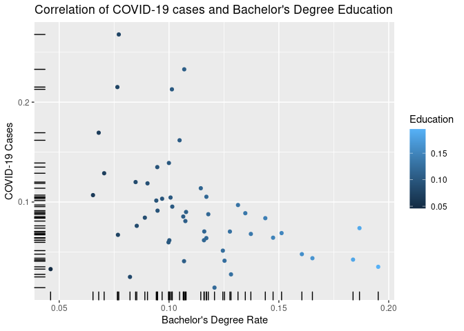
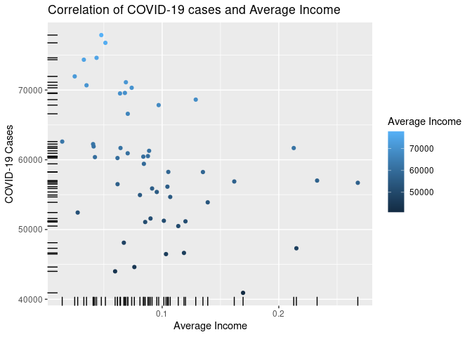
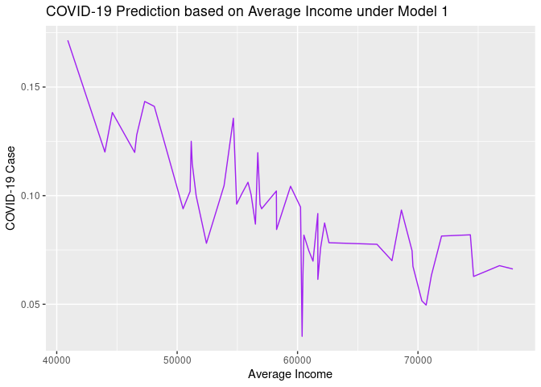
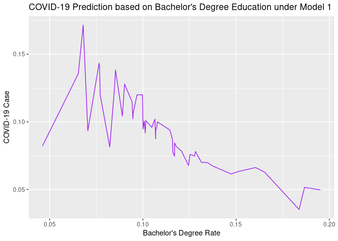

The Influence of Education and Income on COVID-19 Cases Across States in
USA
================
Zixiao Bian
Feb 23rd, 2022

-   [1. Introduction, Hypothesis, and
    Motivation](#1-introduction-hypothesis-and-motivation)
-   [2.1 Packages and Data Import](#21-packages-and-data-import)
-   [2.2 Data Tidy and Transform](#22-data-tidy-and-transform)
-   [2.3 Scatter Plots](#23-scatter-plots)
-   [3. Linear Models and Data
    Analysis](#3-linear-models-and-data-analysis)
-   [4. Data Prediction and Model
    Testing](#4-data-prediction-and-model-testing)
-   [5. Conclusion](#5-conclusion)

**MACS 30500 Homework 6**

**Zixiao Bian**

### 1. Introduction, Hypothesis, and Motivation

More than **two years** has passed since the global pandemic COVID-19
was first detected in the United States. Looking back at March 2020,
individuals must obey the strict quarantine rules to work/ study at
home, and indoor activities were suspended. As the increase in new
domestic cases slowed down, these restrictions were relaxed. We believe
that the **lockdown**, **large-scale COVID-19 testing**, and
**vaccines** will eventually lead to a gradual decrease in new cases.
However, we are more interested in identifying factors related to
confirmed cases of COVID-19 in various US states. In other words, what
is the reason of each states’ struggle? Why do some states end up
suffering more difficulties than others? For example, New York state had
super serious epidemic than, say, Alaska.  
The hypothesis is that **household income** and **higher education**
(bachelor’s degree or higher) in each state are negatively correlated
with confirmed COVID-19 cases.  
This hypothesis is based on the inference that the more educated people
believe in science, the more they will accept the existence of COVID-19,
and they are more **willing** to comply with strict quarantine
regulations actively.

### 2.1 Packages and Data Import

We had **four files** to be imported. “Household_median_income_2017.csv”
measures the median amount of income for households in each state and
D.C. of the US.  
“State-Historical COVID-19.csv” collects the cumulative positive cases
of COVID-19 from the first detected to March 7th, 2021.  
“Education-level by states 2019.csv” indicates the number of people who
obtain a certain educational level by the state in 2019.  
Finally, “state-code.csv” contains all 51 states (including D.C.), the
abbreviations, and the corresponding codes.

``` r
library(tidyr)
library(dplyr)
library(magrittr)
library(ggplot2)
library(purrr)
library(modelr)
library(broom)
income <- read.csv("Data/household_median_income_2017.csv")
coronavirus <- read.csv("Data/State-Historical COVID-19.csv")
education <- read.csv("Data/Education-level by states 2019.csv")
state_abb <- read.csv("Data/state-code.csv")
state_abb = state_abb[state_abb$State != "District of Columbia", ]
```

### 2.2 Data Tidy and Transform

In this chunk, we cleaned the data to maintain the useful part of the
four datasets. The original datasets contain a large amount of
information that is redundant for this project. Since all datasets
contain names of different states, we first extract and rename those
columns to simplify the following analysis. Next, we managed to count
the total population and the number of people with bachelor’s degrees or
higher in a particular state. We then created a data frame that contains
a positive COVID-19 rate, the average income from 2014 to 2017,
bachelor’s degree or higher rate, and names of states for further
analysis.

``` r
# data cleaning
state = as.character(state_abb$State)
abb = as.character(state_abb$Code)
us_income = income[income$State %in% state, ]
covid = coronavirus[coronavirus$state %in% abb, ]
edu = education[education$NAME %in% state, ] 

# rename and select columns
names(state_abb)[names(state_abb) == "Code"] <- "state"

names(covid)[names(covid) == "totalTestResults"] <- "SumTest"
covid <- covid %>% select(state, positive, SumTest)

names(edu)[names(edu) == "NAME"] <- "State"
names(edu)[names(edu) == "Estimate..Total..AGE.BY.EDUCATIONAL.ATTAINMENT..Population.18.to.24.years"] <- "total_edu"
names(edu)[names(edu) == "Estimate..Total..AGE.BY.EDUCATIONAL.ATTAINMENT..Population.18.to.24.years..Bachelor.s.degree.or.higher"] <- "bchlor"
edu <- edu %>% select(State, total_edu, bchlor)

us_income = us_income[1:5]

# join
covid <- left_join(covid, state_abb, by = "state")
df <- left_join(edu, covid, by = "State") %>% 
  left_join(., us_income) %>% 
  subset(., select = -c(state, Abbrev)) %>%
  mutate(posi_percent = positive / SumTest) %>%
  mutate(avg_income = (X2014 + X2015 + X2016 + X2017) / 4) %>%
  mutate(bachlor_rate = bchlor / total_edu)
```

### 2.3 Scatter Plots

We were able to draw graphs based on the data frame created above. The
first one represents a scatterplot of bachelor’s or higher degree rate
and positive COVID-19 cases percentage, and the second one shows the
average income and positive COVID-19 cases percentage. We may observe
from the scatter plot that there are decreasing trends of COVID-19 cases
percentage as either high education rate or average income increases.
However, we need further proof.

``` r
# scatterplot

cor_edu_covid <- ggplot(df, aes(bachlor_rate, posi_percent)) + 
  geom_point(aes(colour = bachlor_rate)) + 
  geom_rug() + 
  ggtitle("Correlation of COVID-19 cases and Bachelor's Degree Education") +
  labs(x="Bachelor's Degree Rate", y="COVID-19 Cases", color = "Education")
cor_edu_covid
```

<!-- -->

``` r
cor_inc_covid <- ggplot(df, aes(posi_percent, avg_income)) + 
  geom_point(aes(colour = avg_income)) + 
  geom_rug() +
  ggtitle("Correlation of COVID-19 cases and Average Income") +
  labs(x="Average Income", y="COVID-19 Cases", color = "Average Income")
cor_inc_covid
```

<!-- -->

### 3. Linear Models and Data Analysis

In this Chunk, we create four models as below. Model 1 and Model 4 are
very similar, yet Model 1 contains an interaction variable of average
income and bachelor’s or higher degree. Model 2 and Model 3 make
regression on bachelor’s or higher degrees and average income
individually. When we observe the report, we may find Model 1 explains
our model the best because of its highest R-squared and the lowest AIC.
However, Model 1 has several problems as well; for example, its BIC is
the largest, and the slopes of variables are not statistically
significant at a traditional 0.05 level. Alternatively, we can make
conclusions based on Model 2 and Model 3 because both models have
statistically significant slopes and relatively low BIC. In Model 2, the
estimated slope of bachelor’s or higher rate is -0.698, with a p-value
of 0.00332, indicating a statistically significant strong negative
correlation with the positive COVID-19 case rate.

Similarly, Model 3 indicates that the average income has, although
extremely weak (-2.355\*(10^-6)), a statistically significant (p-value
0.0044) negative correlation with the positive COVID-19 case rate. We
also made a similar statement from observation of the scatterplots that
are generated above. The three models yield consistent results as we
made in the hypothesis.

The graph of Model 1 is shown below; we may find an overall downward
trend with fluctuations.

``` r
Model1 <-lm(posi_percent ~ avg_income + bachlor_rate + avg_income * bachlor_rate, data=df)
Sum_Model1 <- summary(Model1)
Sum_Model1
```

    ## 
    ## Call:
    ## lm(formula = posi_percent ~ avg_income + bachlor_rate + avg_income * 
    ##     bachlor_rate, data = df)
    ## 
    ## Residuals:
    ##       Min        1Q    Median        3Q       Max 
    ## -0.073940 -0.019737 -0.008152  0.019622  0.147984 
    ## 
    ## Coefficients:
    ##                           Estimate Std. Error t value Pr(>|t|)   
    ## (Intercept)              4.940e-01  1.744e-01   2.833  0.00683 **
    ## avg_income              -5.441e-06  2.706e-06  -2.011  0.05025 . 
    ## bachlor_rate            -3.067e+00  1.720e+00  -1.783  0.08113 . 
    ## avg_income:bachlor_rate  3.905e-05  2.572e-05   1.518  0.13573   
    ## ---
    ## Signif. codes:  0 '***' 0.001 '**' 0.01 '*' 0.05 '.' 0.1 ' ' 1
    ## 
    ## Residual standard error: 0.04803 on 46 degrees of freedom
    ## Multiple R-squared:  0.2552, Adjusted R-squared:  0.2067 
    ## F-statistic: 5.255 on 3 and 46 DF,  p-value: 0.003345

``` r
tidy(Model1)
```

    ## # A tibble: 4 × 5
    ##   term                       estimate  std.error statistic p.value
    ##   <chr>                         <dbl>      <dbl>     <dbl>   <dbl>
    ## 1 (Intercept)              0.494      0.174           2.83 0.00683
    ## 2 avg_income              -0.00000544 0.00000271     -2.01 0.0503 
    ## 3 bachlor_rate            -3.07       1.72           -1.78 0.0811 
    ## 4 avg_income:bachlor_rate  0.0000391  0.0000257       1.52 0.136

``` r
glance(Model1)
```

    ## # A tibble: 1 × 12
    ##   r.squared adj.r.squared  sigma statistic p.value    df logLik   AIC   BIC
    ##       <dbl>         <dbl>  <dbl>     <dbl>   <dbl> <dbl>  <dbl> <dbl> <dbl>
    ## 1     0.255         0.207 0.0480      5.26 0.00335     3   82.9 -156. -146.
    ## # … with 3 more variables: deviance <dbl>, df.residual <int>, nobs <int>

``` r
Model2 <-lm(posi_percent ~ bachlor_rate, data=df)
Sum_Model2 <- summary(Model2)
Sum_Model2
```

    ## 
    ## Call:
    ## lm(formula = posi_percent ~ bachlor_rate, data = df)
    ## 
    ## Residuals:
    ##       Min        1Q    Median        3Q       Max 
    ## -0.105725 -0.024983 -0.004061  0.013131  0.150851 
    ## 
    ## Coefficients:
    ##              Estimate Std. Error t value Pr(>|t|)    
    ## (Intercept)   0.17073    0.02624   6.507  4.2e-08 ***
    ## bachlor_rate -0.69783    0.22578  -3.091  0.00332 ** 
    ## ---
    ## Signif. codes:  0 '***' 0.001 '**' 0.01 '*' 0.05 '.' 0.1 ' ' 1
    ## 
    ## Residual standard error: 0.04976 on 48 degrees of freedom
    ## Multiple R-squared:  0.166,  Adjusted R-squared:  0.1486 
    ## F-statistic: 9.553 on 1 and 48 DF,  p-value: 0.003319

``` r
tidy(Model2)
```

    ## # A tibble: 2 × 5
    ##   term         estimate std.error statistic      p.value
    ##   <chr>           <dbl>     <dbl>     <dbl>        <dbl>
    ## 1 (Intercept)     0.171    0.0262      6.51 0.0000000420
    ## 2 bachlor_rate   -0.698    0.226      -3.09 0.00332

``` r
glance(Model2)
```

    ## # A tibble: 1 × 12
    ##   r.squared adj.r.squared  sigma statistic p.value    df logLik   AIC   BIC
    ##       <dbl>         <dbl>  <dbl>     <dbl>   <dbl> <dbl>  <dbl> <dbl> <dbl>
    ## 1     0.166         0.149 0.0498      9.55 0.00332     1   80.1 -154. -148.
    ## # … with 3 more variables: deviance <dbl>, df.residual <int>, nobs <int>

``` r
Model3 <-lm(posi_percent ~ avg_income, data=df)
Sum_Model3 <- summary(Model3)
Sum_Model3
```

    ## 
    ## Call:
    ## lm(formula = posi_percent ~ avg_income, data = df)
    ## 
    ## Residuals:
    ##       Min        1Q    Median        3Q       Max 
    ## -0.081135 -0.025902 -0.005429  0.006594  0.169088 
    ## 
    ## Coefficients:
    ##               Estimate Std. Error t value Pr(>|t|)    
    ## (Intercept)  2.322e-01  4.723e-02   4.916 1.07e-05 ***
    ## avg_income  -2.355e-06  7.878e-07  -2.989   0.0044 ** 
    ## ---
    ## Signif. codes:  0 '***' 0.001 '**' 0.01 '*' 0.05 '.' 0.1 ' ' 1
    ## 
    ## Residual standard error: 0.05003 on 48 degrees of freedom
    ## Multiple R-squared:  0.1569, Adjusted R-squared:  0.1394 
    ## F-statistic: 8.934 on 1 and 48 DF,  p-value: 0.004403

``` r
tidy(Model3)
```

    ## # A tibble: 2 × 5
    ##   term           estimate   std.error statistic   p.value
    ##   <chr>             <dbl>       <dbl>     <dbl>     <dbl>
    ## 1 (Intercept)  0.232      0.0472           4.92 0.0000107
    ## 2 avg_income  -0.00000235 0.000000788     -2.99 0.00440

``` r
glance(Model3)
```

    ## # A tibble: 1 × 12
    ##   r.squared adj.r.squared  sigma statistic p.value    df logLik   AIC   BIC
    ##       <dbl>         <dbl>  <dbl>     <dbl>   <dbl> <dbl>  <dbl> <dbl> <dbl>
    ## 1     0.157         0.139 0.0500      8.93 0.00440     1   79.8 -154. -148.
    ## # … with 3 more variables: deviance <dbl>, df.residual <int>, nobs <int>

``` r
Model4 <-lm(posi_percent ~ avg_income + bachlor_rate, data=df)
Sum_Model4 <- summary(Model4)
Sum_Model4
```

    ## 
    ## Call:
    ## lm(formula = posi_percent ~ avg_income + bachlor_rate, data = df)
    ## 
    ## Residuals:
    ##      Min       1Q   Median       3Q      Max 
    ## -0.06892 -0.02018 -0.00782  0.01272  0.15435 
    ## 
    ## Coefficients:
    ##                Estimate Std. Error t value Pr(>|t|)    
    ## (Intercept)   2.383e-01  4.608e-02   5.172 4.69e-06 ***
    ## avg_income   -1.546e-06  8.753e-07  -1.767   0.0838 .  
    ## bachlor_rate -4.829e-01  2.522e-01  -1.915   0.0616 .  
    ## ---
    ## Signif. codes:  0 '***' 0.001 '**' 0.01 '*' 0.05 '.' 0.1 ' ' 1
    ## 
    ## Residual standard error: 0.0487 on 47 degrees of freedom
    ## Multiple R-squared:  0.2179, Adjusted R-squared:  0.1846 
    ## F-statistic: 6.548 on 2 and 47 DF,  p-value: 0.003101

``` r
tidy(Model4)
```

    ## # A tibble: 3 × 5
    ##   term            estimate   std.error statistic    p.value
    ##   <chr>              <dbl>       <dbl>     <dbl>      <dbl>
    ## 1 (Intercept)   0.238      0.0461           5.17 0.00000469
    ## 2 avg_income   -0.00000155 0.000000875     -1.77 0.0838    
    ## 3 bachlor_rate -0.483      0.252           -1.91 0.0616

``` r
glance(Model4)
```

    ## # A tibble: 1 × 12
    ##   r.squared adj.r.squared  sigma statistic p.value    df logLik   AIC   BIC
    ##       <dbl>         <dbl>  <dbl>     <dbl>   <dbl> <dbl>  <dbl> <dbl> <dbl>
    ## 1     0.218         0.185 0.0487      6.55 0.00310     2   81.7 -155. -148.
    ## # … with 3 more variables: deviance <dbl>, df.residual <int>, nobs <int>

### 4. Data Prediction and Model Testing

``` r
dfM1 <- df %>% add_predictions(Model1) %>% add_residuals(Model1)

dfM1 %>% ggplot(aes(avg_income,pred))+geom_line(col="Purple") + 
  labs(x="Average Income", y="COVID-19 Case") +
  ggtitle("COVID-19 Prediction based on Average Income under Model 1")
```

<!-- -->

``` r
dfM1 %>% ggplot(aes(bachlor_rate,pred))+geom_line(col="Purple") +
  labs(x="Bachelor's Degree Rate", y="COVID-19 Case") +
  ggtitle("COVID-19 Prediction based on Bachelor's Degree Education under Model 1")
```

<!-- -->

### 5. Conclusion

Conclusion Our project analyzed the relationship between average income
during 2014-2017, the high education rate (bachelor’s degree or higher),
and the positive COVID-19 cases rate in 51 states, including D.C., in
the United States. We hypothesized that household income and higher
education (bachelor’s degree or higher) rates in each state are
negatively correlated with the positive COVID-19 case rate.

Throughout our analysis, we collected data, cleaned the data, and
created four models. We found three of them reasonable and interpreted
them to find the results. Our research finally yields consistent results
as we hypothesized beforehand. We may conclude that the average income
and high education rate are negatively correlated with the positive
COVID-19 case rate in certain states. To be more specific, the higher
the average income or the higher the residents’ education level in a
state, the lower the positive COVID-19 case rate.

However, our study has limitations. For instance, the average income
rate might not be representative of people’s wealth in a state because a
small proportion of high-income people may pull up the average income,
even if most people in this state are not wealthy. Thus, the median
income would be a better alternative. On the other hand, there might be
more scientific algorithms to calculate the positive COVID-19 rate. In
future studies, we may try to overcome such difficulties and obtain more
convincing results with fewer biases.
